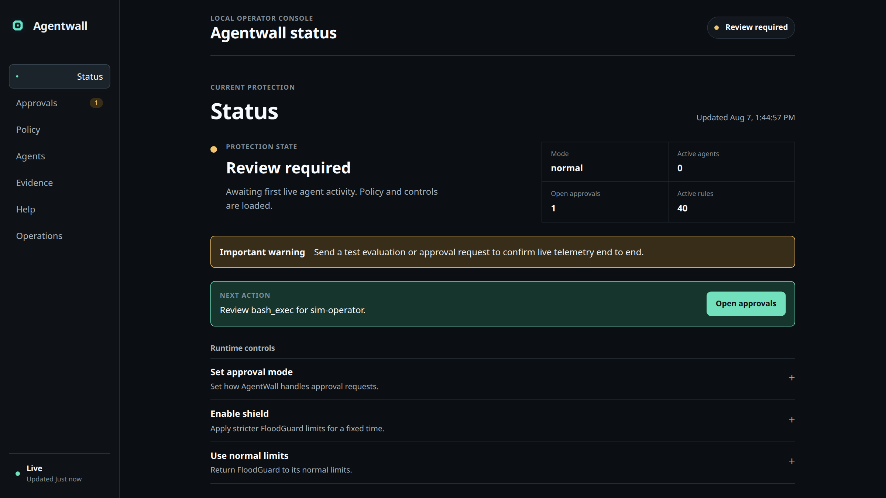
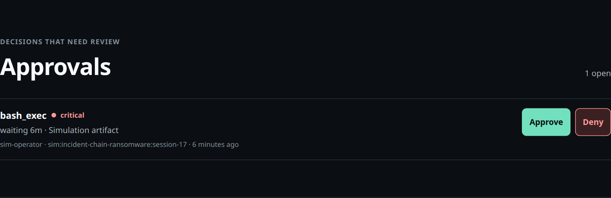
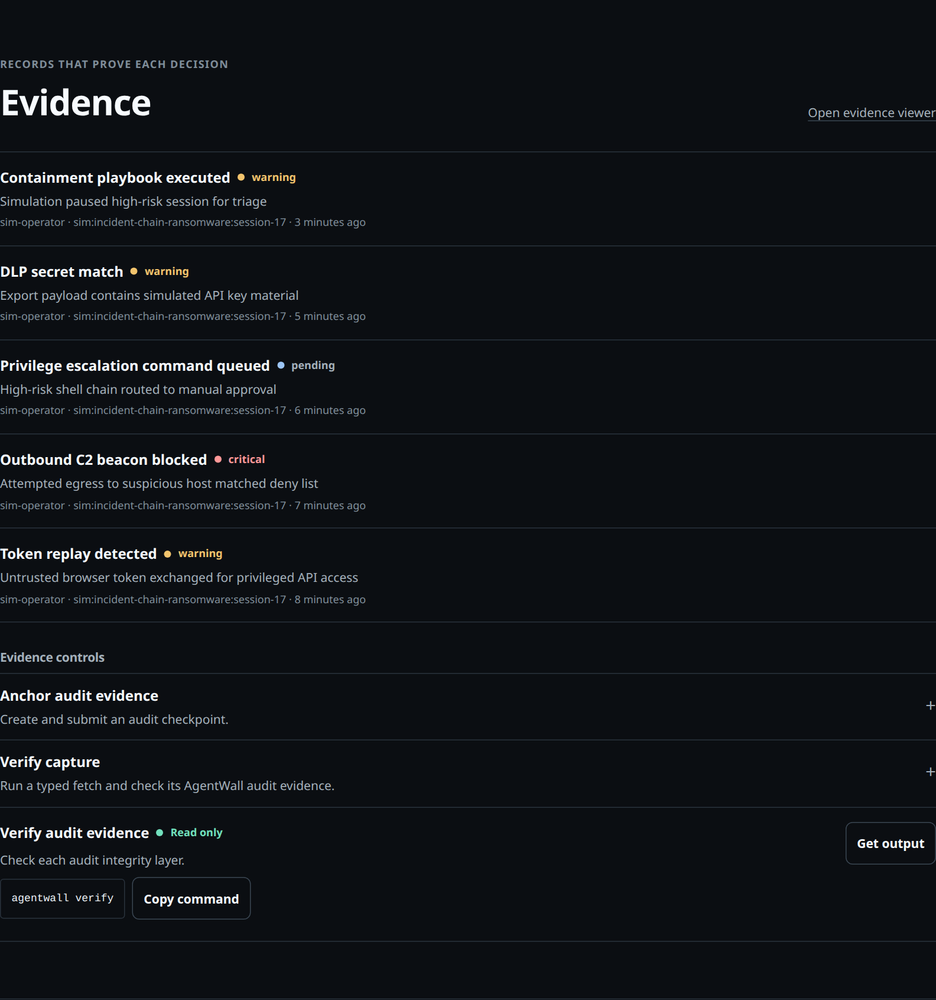
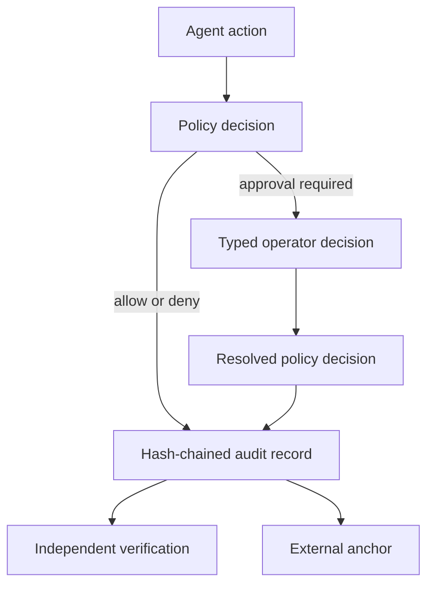

<p align="center">
  <picture>
    <source media="(prefers-color-scheme: dark)" srcset="assets/brand/agentwall-logo-reverse.svg">
    
  </picture>
</p>

<p align="center"><strong>Agentwall gives operators control of AI agent actions before those actions become real.</strong></p>

<p align="center">
  <a href="https://github.com/repsecure/agentwall/actions/workflows/ci.yml"></a>
  <a href="https://github.com/repsecure/agentwall/actions/workflows/codeql.yml"></a>
  <a href="docs/install.md#requirements"></a>
  <a href="LICENSE"></a>
  <a href="SECURITY.md"></a>
</p>

<p align="center">
  <a href="#run-from-source"><strong>Run from source</strong></a>
  &nbsp;·&nbsp;
  <a href="docs/architecture.md"><strong>Read the architecture</strong></a>
</p>



## Enforce. Approve. Prove.

### [Enforce](docs/enforcement.md)

Apply network, tool, content, identity, MCP, and runtime policy before an action proceeds. Default proxy capture remains cooperative unless Linux host controls add a stronger boundary.

### [Approve](docs/operator-guide.md)

Route high-risk actions through typed operator decisions with explicit reasons and next actions. These controls apply only inside Agentwall decision paths.

### [Prove](docs/verification.md)

Keep hash-chained records and verify them with independent implementations. Verification proves the integrity of written records, not the completeness of capture.

## Run from source

> The public npm package is not released yet. Use the source install below.

```bash
git clone https://github.com/repsecure/agentwall.git
cd agentwall
npm ci
npm run build
node dist/cli.js version
node dist/cli.js ui
```

Agentwall requires Node.js 22.12 or newer. The install, build, and version commands must exit with status 0. The UI stays active and prints its loopback URL.

After setup and service start, run `node dist/cli.js doctor`. It exits 0 for clear, 1 for observed blocked traffic, or 2 when it cannot distinguish the state.

`@repsecure/agentwall` is the intended scoped package name. Registry publication remains a separate approval-gated release action.

## Capabilities and limits

| Area | Implemented control and documented boundary |
| --- | --- |
| [Policy](docs/feature-reference.md) | Applies network, tool, content, identity, and runtime decisions. [Default capture can be bypassed](docs/limits.md). |
| [Operator control](docs/feature-reference.md) | Provides typed approvals and session actions. [Direct external actions stay outside these paths](docs/limits.md). |
| [Evidence](docs/feature-reference.md) | Writes hash-chained records and external anchor data. [Integrity does not prove completeness](docs/limits.md). |
| [Agent identity](docs/feature-reference.md) | Issues credentials and applies per-agent budgets. [State and identity have per-instance scope](docs/limits.md). |
| [MCP](docs/feature-reference.md) | Checks JSON-RPC and detects inventory drift. [A baseline does not prove safe server code](docs/limits.md). |
| [Linux host controls](docs/feature-reference.md) | Adds a perimeter and process sandbox. [Kernel and platform support set the boundary](docs/limits.md). |

## Decisions and evidence in context

### A typed approval at the point of risk

The built-in incident simulation marks every synthetic record as simulation data.



### Evidence with verification controls

The evidence view keeps simulated events beside the real chain and anchor status.



## Architecture flow



See the [architecture](docs/architecture.md) for request paths, control paths, and deployment boundaries.

## Assurance evidence and trust boundaries

### Evidence in the repository

- The [verification design](docs/verification.md) covers TypeScript, Go, Rust, and Python verifier implementations.
- The [conformance harness](scripts/conformance.js) runs the same forgery corpus across all four implementations.
- The [CodeQL workflow](.github/workflows/codeql.yml) and [gitleaks workflow](.github/workflows/security.yml) define static and secret scans.
- The [release workflow](.github/workflows/release.yml) defines checksums and provenance for approved releases. Its presence does not prove a public package exists.
- The [threat model](docs/threat-model.md) and [limits](docs/limits.md) state the protected and unprotected paths.

### Trust boundaries

- A process that ignores proxy configuration can bypass default proxy capture.
- TLS content stays opaque without reviewed interception for configured hosts and runtimes.
- Audit verification proves the integrity of written records, not record completeness.
- Fleet identity, policy, credentials, and budgets have per-instance scope.

## Documentation and project trust

| Need | Path |
| --- | --- |
| Start | [User guide](docs/user-guide.md), [install guide](docs/install.md), and [documentation index](docs/README.md) |
| Operate | [Operator guide](docs/operator-guide.md) and [feature reference](docs/feature-reference.md) |
| Understand | [Architecture](docs/architecture.md), [threat model](docs/threat-model.md), and [limits](docs/limits.md) |
| Report a vulnerability | Use the private process in [SECURITY.md](SECURITY.md). Do not use a public issue. |
| Contribute | Read [CONTRIBUTING.md](CONTRIBUTING.md) and [GOVERNANCE.md](GOVERNANCE.md). |
| License | Agentwall uses [Apache-2.0](LICENSE). See the [NOTICE](NOTICE). |
